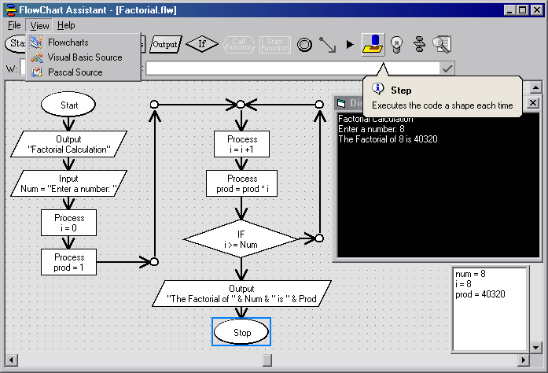



## Flowchart Assistant \- Design and run flowcharts

### Description

Complete Application!

Design and test flowcharts. Execute code step-by step, add watches and see how variables change, create loops, export flowchart to visual basic and Turbo pascal source code, Print the flowchart.

Please vote!
 
### More Info
 

             |
---                |---
**Submitted On**   |2004-04-24 19:38:32
**By**             |[Lefteris Eleftheriades](https://github.com/Planet-Source-Code/PSCIndex/blob/master/ByAuthor/lefteris-eleftheriades.md)
**Level**          |Intermediate
**User Rating**    |4.8 (86 globes from 18 users)
**Compatibility**  |VB 6\.0
**Category**       |[Complete Applications](https://github.com/Planet-Source-Code/PSCIndex/blob/master/ByCategory/complete-applications__1-27.md)
**World**          |[Visual Basic](https://github.com/Planet-Source-Code/PSCIndex/blob/master/ByWorld/visual-basic.md)
**Archive File**   |[Flowchart\_173944512004\.zip](https://github.com/Planet-Source-Code/lefteris-eleftheriades-flowchart-assistant-design-and-run-flowcharts__1-53493/archive/master.zip)

